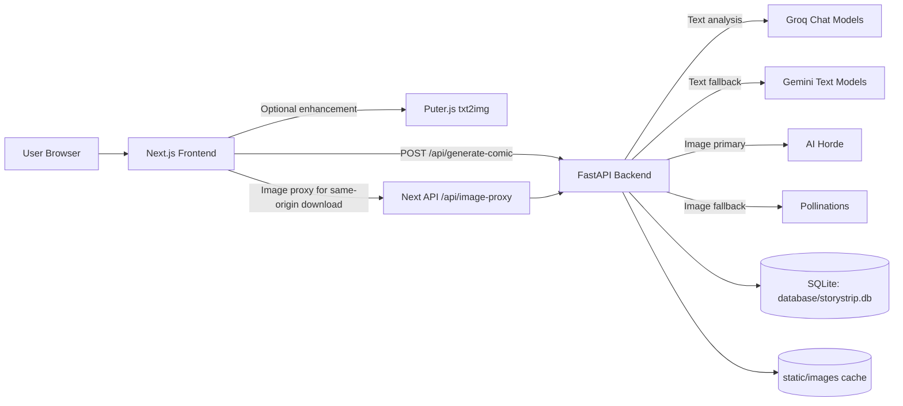
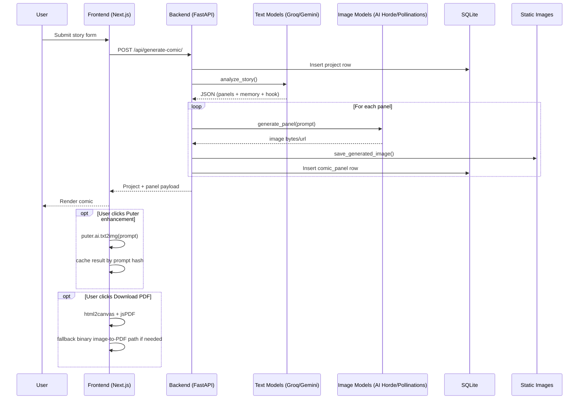

# PanelCraft: AI Comic Generator

PanelCraft is a full-stack AI storytelling platform that converts free-form story ideas into multi-panel comics with generated art, narrative memory, and continuation hooks.

It is designed as a resilient, provider-fallback architecture:
- Text pipeline: Groq primary, Gemini fallback.
- Image pipeline: AI Horde primary (Gemini image optional/toggleable), Pollinations fallback.
- Client-side enhancement: Puter-based free regeneration for single/all panels.

## Table of Contents

1. Product Overview
2. System Design
3. Architecture
4. End-to-End Data Flow
5. AI Orchestration Strategy
6. Data Model
7. API Contract
8. Configuration Reference
9. Local Development
10. Deployment and Operations Notes
11. Troubleshooting Runbook
12. Project Structure

## Product Overview

### Core capabilities

- Convert raw story text into structured comic episodes.
- Produce 8-10 cinematic panels with scene descriptions, dialogue/captions, and image prompts.
- Generate panel artwork with safety-aware, multi-provider fallback logic.
- Persist projects and panels for retrieval and replay.
- Continue stories using serialized `memory_state` and `continuation_hook`.
- Regenerate panel images in-browser with Puter (`puter.ai.txt2img`) and local prompt cache.
- Download generated panels as PDF from the frontend.

### Non-functional goals

- High availability despite provider instability (timeouts, 403/429, policy blocks).
- Deterministic output persistence (prompt-hash image cache).
- Safe-by-default prompt sanitization and stricter retry variants.
- Low-friction local development with lightweight SQLite.

## System Design



## Architecture

### Frontend (Next.js 15 + React 19)

- App Router UI in `frontend/src/app/page.tsx`.
- Main comic rendering and export component in `frontend/src/components/ComicDisplay.tsx`.
- Client-side Puter enhancement pipeline:
    - On-demand SDK load from `https://js.puter.com/v2/`.
    - Prompt-keyed local cache in `localStorage`.
    - Single panel and batch panel regeneration.
- Image proxy route (`frontend/src/app/api/image-proxy/route.ts`) to eliminate CORS/canvas taint issues during PDF export.

### Backend (FastAPI + SQLAlchemy)

- API entrypoint: `backend/app/main.py`.
- REST endpoints: `backend/app/api/routes.py`.
- Core orchestration service: `backend/app/services/story_service.py`.
- Persistence:
    - SQLite database at `database/storystrip.db`.
    - Generated image assets in `backend/static/images`.

## Data Model

### Persistence and schema

- `projects`
    - `id`, `title`, `story_text`, `memory_state`, `continuation_hook`, `created_at`, `updated_at`
- `comic_panels`
    - `id`, `project_id`, `panel_number`, `scene_description`, `panel_text`, `image_prompt`, `image_url`, `created_at`

## End-to-End Data Flow



## AI Orchestration Strategy

### Text generation

- Primary: `GROQ_TEXT_MODELS` chain.
- Fallback: `GEMINI_TEXT_MODELS` chain.
- Structured JSON parsing with resilient extraction (`_parse_json_safely`).
- Retry/backoff for throttling and transient failures.

### Image generation

Current default production posture:
- Gemini image can be disabled with `GEMINI_IMAGE_ENABLED=false`.
- Primary image path: AI Horde (`_generate_with_aihorde`).
- Secondary fallback: Pollinations URL strategy (`_build_free_fallback_urls`).

Reliability controls:
- Prompt-level deterministic cache (`cache-<hash>.png`).
- Progressive SFW prompt variants.
- AI Horde dynamic profile degradation on 403:
    - configured profile
    - safe fallback (768x1152)
    - light fallback (512x768)
- Provider circuit breakers when repeatedly failing.

Quality controls:
- Prompt enrichment via Groq text pass.
- Post-process normalization (`_postprocess_generated_image`):
    - resize/crop to target dimensions
    - unsharp mask
    - contrast/sharpness enhancement

Safety controls:
- Unsafe-term replacement map.
- Policy/NSFW signal detection across providers.
- Negative prompt injection for Horde.

### Puter client-side enhancement

- Triggered manually from UI (`Use Puter (This Panel)` / `Use Puter (All Panels)`).
- Runs in browser (no backend API key required).
- Prompt cache in `localStorage` to minimize duplicate calls.

## API Contract

### `POST /api/generate-comic/`

Request body:

```json
{
    "title": "Episode 1",
    "story_text": "A retired grandmother discovers a cosmic ledger...",
    "genre": "Action/Adventure",
    "mood": "Dramatic",
    "style": "Modern Comic Book",
    "memory_state": null
}
```

Response (shape):

```json
{
    "id": 1,
    "title": "Episode 1",
    "story_text": "...",
    "memory_state": "{...json string...}",
    "continuation_hook": "...",
    "created_at": "2026-04-14T12:00:00Z",
    "panels": [
        {
            "panel_number": 1,
            "scene_description": "...",
            "panel_text": "...",
            "image_prompt": "...",
            "image_url": "/static/images/cache-xxxx.png"
        }
    ]
}
```

### `GET /api/projects/`

- Returns all saved projects and associated panels.

### `GET /api/projects/{project_id}`

- Returns one project with all panels.

### `GET /`

- Backend health check.

## Configuration Reference

### Backend `.env`

Required:

```env
GROQ_API_KEY=your_groq_key_here
```

Optional (text fallback):

```env
GEMINI_API_KEY=your_gemini_key_here
```

Recommended baseline:

```env
# Text models
GROQ_TEXT_MODELS=llama-3.3-70b-versatile,llama-3.1-8b-instant,mixtral-8x7b-32768
GEMINI_TEXT_MODELS=gemini-2.0-flash,gemini-1.5-flash

# Gemini image models (kept for future toggling)
GEMINI_IMAGE_MODELS=gemini-3.1-flash-image-preview,gemini-3-pro-image-preview,gemini-2.5-flash-image
GEMINI_IMAGE_ENABLED=false

# AI Horde
AIHORDE_API_KEY=0000000000
AIHORDE_MODELS=DreamShaper XL,JuggernautXL,Deliberate
AIHORDE_MODEL_PREFERENCES=DreamShaper XL,JuggernautXL,Deliberate
AIHORDE_IMAGE_WIDTH=768
AIHORDE_IMAGE_HEIGHT=1152
AIHORDE_STEPS=24
AIHORDE_CFG_SCALE=7.0
AIHORDE_SAMPLER_NAME=k_euler_a
AIHORDE_POST_PROCESSORS=
AIHORDE_NEGATIVE_PROMPT=nsfw,nude,nudity,explicit,sexual content,gore,graphic violence,watermark,text,logo,blurry,lowres
AIHORDE_POLL_SECONDS=2.5
AIHORDE_TIMEOUT_SECONDS=90

# Output normalization
TARGET_IMAGE_WIDTH=1024
TARGET_IMAGE_HEIGHT=1536
```

### Frontend `.env.local`

```env
NEXT_PUBLIC_API_BASE=http://127.0.0.1:8000
NEXT_PUBLIC_PUTER_TEST_MODE=false
```

Notes:
- Keep AI Horde generation dimensions at `768x1152` (or lower) for reliable acceptance; upscale is handled post-generation.
- `GEMINI_IMAGE_ENABLED` controls image generation only; Gemini text fallback remains available.

## Local Development

### Prerequisites

- Node.js 18+
- Python 3.10+ (3.11 recommended)
- `pip` / virtualenv

### Backend

```bash
cd backend
python -m venv venv
```

Windows PowerShell:

```powershell
.\venv\Scripts\activate
pip install -r requirements.txt
.\venv\Scripts\python.exe -m uvicorn app.main:app --reload --host 127.0.0.1 --port 8000
```

macOS/Linux:

```bash
source venv/bin/activate
pip install -r requirements.txt
python -m uvicorn app.main:app --reload --host 127.0.0.1 --port 8000
```

### Frontend

```bash
cd frontend
npm install
npm run dev
```

Visit `http://localhost:3000`.

### Makefile note

`Makefile` commands are currently Unix-oriented (use `source`, `lsof`, etc.). On Windows, prefer manual commands above unless running inside WSL.

## Deployment and Operations Notes

- Backend static assets are served from `/static` via FastAPI.
- Frontend uses Next.js App Router and includes API route `/api/image-proxy` for same-origin image transport.
- For production, place backend behind a reverse proxy and persist `database/` + `backend/static/images/` volumes.
- Rotate API keys if exposed in logs or commits.

## Troubleshooting Runbook

### 1) Backend fails to boot with launcher/path errors

Use module invocation instead of direct `uvicorn.exe`:

```powershell
.\venv\Scripts\python.exe -m uvicorn app.main:app --reload --host 127.0.0.1 --port 8000
```

### 2) Gemini image errors (`API_KEY_INVALID`)

- Set `GEMINI_IMAGE_ENABLED=false` (current default recommendation).
- Keep Gemini for text fallback only, or replace key with valid one.

### 3) AI Horde 403 on generation

- Reduce profile cost:
    - `AIHORDE_IMAGE_WIDTH=768`
    - `AIHORDE_IMAGE_HEIGHT=1152`
    - `AIHORDE_STEPS=24`
- Ensure model list is not filtered to unsupported workers.

### 4) Download PDF errors from frontend

- Use latest code with `/api/image-proxy` route.
- Restart frontend dev server after route changes.
- Confirm backend is reachable at `NEXT_PUBLIC_API_BASE`.

### 5) Empty or malformed panel output

- Check provider logs for 429/5xx and retry events.
- Verify `GROQ_API_KEY` and optional Gemini text key.

## Project Structure

```text
Ai_comic_generator/
├── backend/
│   ├── app/
│   │   ├── api/
│   │   │   └── routes.py
│   │   ├── models/
│   │   │   └── database.py
│   │   ├── services/
│   │   │   └── story_service.py
│   │   ├── database.py
│   │   └── main.py
│   ├── requirements.txt
│   └── .env
├── frontend/
│   ├── src/
│   │   ├── app/
│   │   │   ├── api/
│   │   │   │   └── image-proxy/route.ts
│   │   │   ├── layout.tsx
│   │   │   └── page.tsx
│   │   └── components/
│   │       ├── ComicDisplay.tsx
│   │       ├── ThemeProvider.tsx
│   │       └── ThemeToggle.tsx
│   ├── package.json
│   ├── next.config.mjs
│   └── next.config.ts
├── database/
│   └── storystrip.db
├── static/
│   └── images/
├── Makefile
└── README.md
```

## Tech Stack Summary

### Frontend

- Next.js 15.3.0 (App Router + Turbopack)
- React 19
- Tailwind CSS 4
- html2canvas + jsPDF for export
- Puter.js for free client-side image enhancement

### Backend

- FastAPI 0.104.1
- Uvicorn 0.24.0
- SQLAlchemy 2.0.23 + SQLite
- OpenAI SDK (Groq-compatible endpoint)
- google-genai SDK (text fallback / optional image)
- Requests + Pillow for image IO/postprocessing

## License and Credits

- Built with FastAPI, Next.js, Groq, AI Horde, Gemini, Pollinations, and Puter.
- Inspired by the intersection of narrative design and visual AI tooling.